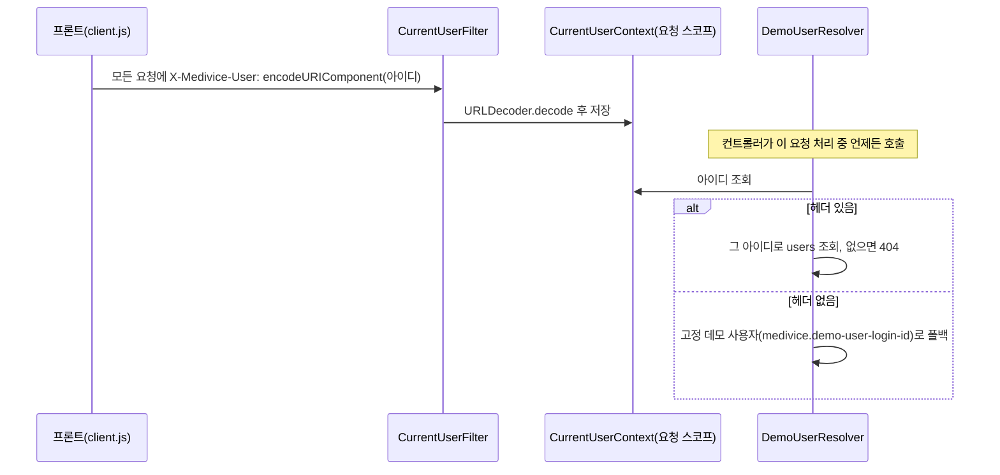
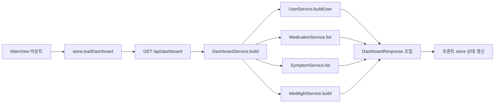
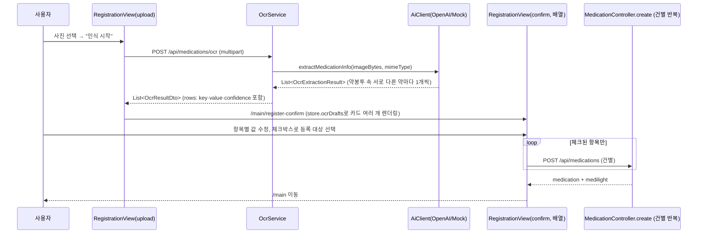
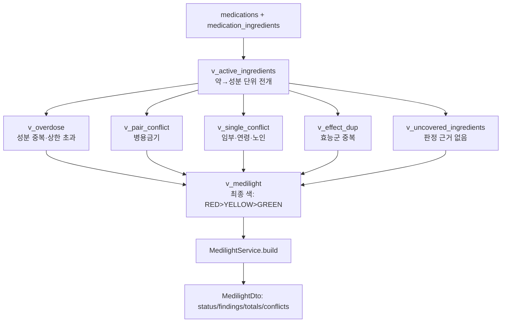

# 메디바이스 기능별 로직도

- 최종 갱신일: 2026-09-03
- 범위: 프론트(`front/src`) → 백엔드(`../src/main/java/com/project/medivice`) → DB/AI로 이어지는 실제 요청 흐름
- 표기: `프론트` = Vue 컴포넌트/스토어, `백엔드` = Spring 컨트롤러/서비스, `DB` = PostgreSQL(스키마 `medivice`), `AI` = OpenAI(`OpenAiClient`) 또는 Mock(`MockAiClient`)

모든 기능은 세션·토큰이 없고, **`X-Medivice-User` 헤더(로그인 아이디)로 매 요청마다 사용자를 식별**한다(`CurrentUserFilter` → `CurrentUserContext` → `DemoUserResolver`). 헤더가 없으면 `application.properties`의 고정 데모 사용자로 폴백한다.

---

## 0. 공통 — 사용자 식별

한글 등 비ASCII 아이디는 HTTP 헤더에 원문 그대로 넣을 수 없어(ISO-8859-1 제약) `encodeURIComponent`로 인코딩하고, 백엔드가 짝을 맞춰 디코딩한다(`front/TROUBLESHOOTING.md` #14).

---

## 1. 회원가입 · 로그인 (UC1·2)

**파일**: `views/AuthView.vue` → `stores/medivice.js`(`signup`/`login`) → `api/client.js` → `AuthController` → `AuthService` → `UserRepository`

1. 프론트: 아이디·비밀번호·성별·생년월일 입력.
2. `POST /api/auth/signup` — 백엔드는 비밀번호를 실제로 해싱·검증하지 않는다(Sprint 1 축소 범위, 자리표시자만 저장). 이미 있는 아이디면 그 사용자를 그대로 반환.
3. 없으면 `users` 테이블에 새로 생성 → `UserService.buildUser()`로 `UserDto` 조립해 응답.
4. 프론트: 응답의 `username`을 `localStorage`(`medivice_login_id`)에 저장 → 이후 모든 요청의 `X-Medivice-User` 헤더 값이 된다.
5. 로그인(`POST /api/auth/login`)은 아이디 존재 여부만 확인(없으면 404) — 비밀번호 검증 없음.

---

## 2. 대시보드 로드 (SCR-MAIN-001)

**파일**: `views/MainView.vue`(`onMounted`) → `stores/medivice.js`(`loadDashboard`) → `DashboardController` → `DashboardService`

`DashboardService`가 사용자·복용 목록·최근 증상 기록·메디라이트 판정을 한 번에 모아 응답한다(화면 하나가 이 응답만으로 렌더링됨 — 루브릭의 "Mock API를 활용한 실제 데이터 바인딩" 요구를 만족).

---

## 3. 약 등록 — 수기 (UC13)

**파일**: `views/RegistrationView.vue`(`saveManual`) → `MedicationController.create` → `MedicationService.create` → `MedicationRepository`/`IngredientRepository`/`SafetyCheckService`

1. 프론트: 제품명·성분(복합제면 여러 개)·함량·단위·용법·등록 사유 입력 → `ingredients` 배열로 전송.
2. `MedicationService.create()`:
   - `type=PRESCRIPTION`이면 `prescriptions` 행 먼저 생성(병원·진료과·기간).
   - `medications` 행 생성(처방 있으면 연결, 없으면 `register_reason`에 자유 입력 저장).
   - **성분마다 반복**: `IngredientRepository.findOrCreateByName()` — DUR 마스터에 같은 이름이 있으면 그 `ingredient_id`를 재사용(그래야 병용금기·중복 판정에 걸림), 없으면 새로 만듦(`USR-` 코드, 판정 근거 없음으로 분류됨).
   - `medication_ingredients`에 성분별 함량 저장.
   - `SafetyCheckService.recordCheck(REGISTER)` — 등록 직후 판정 스냅샷을 `safety_checks`/`safety_check_items`에 남김(감사 로그, 화면 응답과는 별개).
   - `MedilightService.build()`로 최신 판정을 다시 계산해 응답에 포함.
3. 프론트: 응답의 `medication`을 목록에 추가, `medilight`를 그대로 반영(재조회 없이 즉시 갱신).

---

## 4. 약 등록 — 사진 인식 (UC8~12, EXT-1)

**파일**: `views/RegistrationView.vue`(`startOcr`→`confirmOcr`) → `stores/medivice.js`(`runOcr`) → `MedicationController.ocr` → `OcrService` → `AiClient`(`OpenAiClient`/`MockAiClient`)

핵심 설계 포인트:

- **응답은 항상 배열**이다. 사진 한 장(특히 약봉투)에 서로 다른 약 여러 개가 있을 수 있어서, `AiClient.extractMedicationInfo`는 `List<OcrExtractionResult>`를 반환한다. "복합제(알약 하나에 성분 여러 개)"와 "봉투 안 서로 다른 약 여러 개"는 프롬프트에서 명시적으로 구분한다.
- **정확성 우선 원칙**: 프롬프트가 "확신 없으면 지어내지 말고 null로 두라"고 명시한다 — 그럴듯한 실제 약 이름으로 추측(환각)하는 것을 막기 위함(`front/TROUBLESHOOTING.md` #15).
- **저장은 별도 단계**: OCR 자체는 아무것도 저장하지 않는다. 확인 화면에서 사용자가 값을 고치고 체크한 항목만, 수기 등록과 동일한 `POST /api/medications` 경로로 하나씩 등록된다(D-4: 확인 전 저장 금지). 여러 건이면 순서대로 `await` — 부분 실패 시 어느 항목에서 멈췄는지 알 수 있게.
- **신뢰도 노출**: `OcrResultDto.rows[].confidence`를 화면에 그대로 보여주고(D-4), 0.7 미만은 경고 스타일로 구분한다.
- **AI 모델 교체 지점**: `medivice.ai.provider` 설정값만 바꾸면 `MockAiClient` ↔ `OpenAiClient`가 전환된다(`AiClient` 인터페이스가 경계).

---

## 5. 약 삭제 (UC14)

**파일**: `views/MedicationsView.vue`(`removeMedication`) → `stores/medivice.js`(`removeMedication`) → `MedicationController.delete` → `MedicationService.delete`

1. `DELETE /api/medications/:id` → `medications.ended_at`을 오늘 날짜로 채우는 **소프트 삭제**(물리 삭제 아님 — 과거 증상 기록의 복용 스냅샷이 깨지지 않도록).
2. `SafetyCheckService.recordCheck(DELETE)`로 판정 스냅샷 재기록.
3. 응답 본문이 없으므로(204) 프론트가 이어서 `GET /api/medilight`를 별도 호출해 최신 판정을 반영.

---

## 6. 증상 기록 (UC20·21)

**파일**: `views/SymptomEntryView.vue`(`save`) → `stores/medivice.js`(`addSymptom`) → `SymptomController` → `SymptomService` → `SymptomRepository`

1. 날짜·작성 시각(표시용, 서버는 `written_at`을 자동 채움)·증상 다중 선택·메모 입력.
2. `POST /api/symptoms` → `side_effect_logs` 생성 → 선택한 증상마다 `side_effect_symptoms` 연결(마스터에 없는 자유 입력은 '기타' 분류로 즉석 생성) → **그 시점의 활성 복용 목록을 값 복사로 `side_effect_snapshots`에 저장**(사용자가 약을 직접 고르지 않음 — 나중에 그 약이 삭제돼도 기록은 남아야 하므로).
3. 응답으로 저장된 스냅샷 포함 `SymptomDto` 반환.

---

## 7. 보고서 생성 (UC28·29)

**파일**: `views/ReportView.vue`(`createReport`) → `stores/medivice.js`(`createReport`) → `ReportController` → `ReportService` → `AiClient.summarizeReport`

1. 기간·언어 선택 → `POST /api/reports`.
2. `ReportService`가 그 시점 활성 복용 목록 수, `MedilightService.build()` 결과에서 WARN/CRIT 건수, 기간 내 증상 기록 수를 **먼저 규칙 기반으로 집계**.
3. 집계된 숫자만 `AiClient.summarizeReport(ReportContext)`에 넘겨 AI가 2~3문장으로 풀어씀 — AI는 숫자를 만들지 않고 이미 정해진 사실만 서술(색·수치는 절대 AI가 결정하지 않는다는 서비스 원칙을 인터페이스 경계에서 강제).
4. 비동기 워커 없이 요청 스레드 안에서 즉시 `COMPLETED`까지 처리해 응답(2일차 요구 "PENDING→PROCESSING→COMPLETED" 상태값은 프론트가 그대로 표시하되 실제로는 동기 처리).

---

## 8. 메디라이트 판정 (모든 기능의 공통 기반)

**파일**: `MedilightService.build()` — DB 뷰(`v_active_ingredients`, `v_overdose`, `v_pair_conflict`, `v_single_conflict`, `v_effect_dup`, `v_uncovered_ingredients`, `v_medilight`, `v_safety_notice`)를 그대로 읽어 프론트 응답 모양으로 옮긴다.

**중요**: 색과 판정 사유는 백엔드 Java 코드가 계산하지 않는다 — **DB 뷰가 규칙 엔진**이다. `MedilightService`는 그 결과를 `MedilightDto`(status/findings/totals/conflicts) 모양으로 변환하는 뷰 모델일 뿐이다. 등록·삭제 API가 호출될 때마다(3·4·5절) 이 뷰들을 다시 읽어 최신 상태를 응답에 포함시킨다.

`status` 매핑: DB의 `RED/YELLOW/GREEN` → 프론트 계약의 `CRIT/WARN/OK`.
